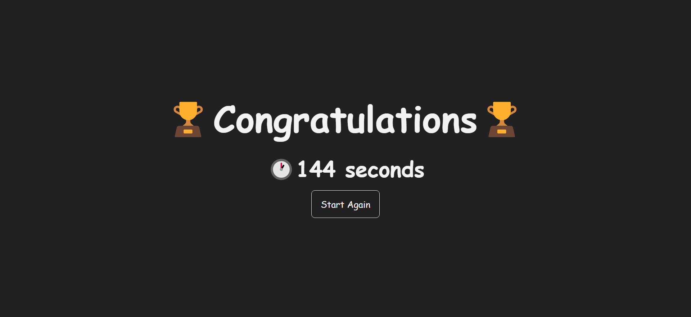

# POKEMON FLIP CARD
## Pokemon Flip Card is simple game


## :mag_right:Technologies And Packages Used
**Framework: Vue 3** 


## :pencil:Features
List the ready features here:
- 4 Mode To Play Game
- Game Screen
- Result Your Score

## :camera:Screenshots





## :wrench: Project setup
```
npm install
```

### Compiles and hot-reloads for development
```
npm run serve
```

### Compiles and minifies for production
```
npm run build
```

### Lints and fixes files
```
npm run lint
```

### Customize configuration
See [Configuration Reference](https://cli.vuejs.org/config/).
